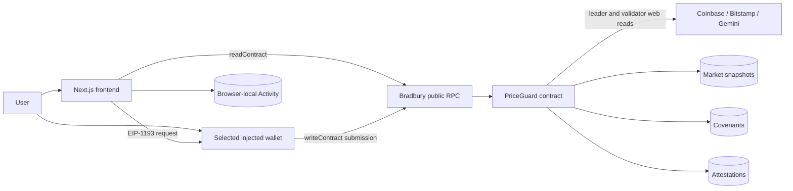
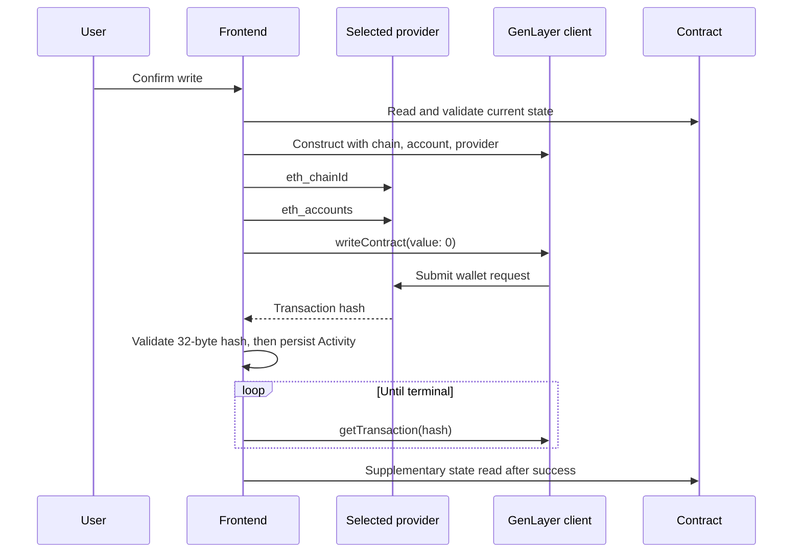

# Architecture

PriceGuard Covenant V2 separates browser presentation, deterministic client-side validation, GenLayer consensus, and contract storage. The active contract is non-custodial and stores no funds.

## System overview



## Frontend

The Next.js App Router application provides market, covenant, attestation, wallet, Activity, integration, and verification views. `ProtocolProvider` refreshes the server protocol route every 30 seconds. Client components perform direct contract reads where exact IDs or wallet indexes are needed.

All contract responses used by the current frontend pass exact runtime guards in `lib/types.ts`. Missing fields, extra fields, incorrect primitive types, invalid IDs, unexpected enum values, or internally inconsistent counts fail closed in the UI.

## Read path

Read clients are created with `createClient({ chain: testnetBradbury })`. They use Bradbury's public RPC and do not require a wallet connection. Reads include the current market, protocol statistics, covenants, attestation records, retained histories, and owner indexes.

The `/api/protocol` route also fetches a current three-venue API preview. That preview is explicitly separate from contract consensus: it is not stored, is not validator output, and cannot satisfy a covenant.

## Write path



Submission has five diagnostic stages: preparation, client initialization, network verification, wallet submission, and transaction-hash validation. Preparation checks method/action consistency, argument shape, current contract state, authorization, time windows, duplicate deterministic IDs, and revision ownership. No transaction is recorded in Activity unless the returned value is a valid 32-byte hexadecimal hash.

## Selected injected provider

Wallet discovery uses EIP-6963 announcements. Each valid announcement is keyed by its provider UUID; duplicate announcements for the same provider object are de-duplicated. When a user chooses an entry, connection resolves the chosen UUID back to the same provider object and calls `eth_requestAccounts` on that provider. The selected identifier is preserved while that provider remains in the discovered set. `window.ethereum` is used only as a legacy fallback when no EIP-6963 provider has been announced.

The application does not inspect the nonstandard `window.ethereum.providers` array and does not use WalletConnect.

## GenLayer client construction

Read clients contain only the Bradbury chain. Write clients are constructed with the Bradbury chain, the connected account, and the selected EIP-1193 provider:

```ts
createClient({
  chain: testnetBradbury,
  account: wallet,
  provider,
})
```

Normal writes do not call `client.connect()`. This keeps wallet requests on the selected injected provider and avoids the Snap-probing connection path that was incompatible with the diagnosed MetaMask environment. It also supports Rabby without changing contract arguments or transaction behavior.

Immediately before `writeContract`, the frontend calls `eth_chainId` and `eth_accounts`. A chain other than `4221`, a missing account, or an account different from the connected PriceGuard session aborts before the wallet submission call.

## Contract consensus boundary

Only `contracts/priceguard.py` defines consensus-critical market policy. For each refresh or evaluation:

1. The leader fetches the three fixed source endpoints and returns canonical JSON with raw observations and derived fields.
2. Validators require the exact payload schema and recompute accepted observations, median, minimum, maximum, spread, rejection count, confidence, and breaker state.
3. Validators independently fetch and normalize the same sources.
4. The validator rejects a leader/validator median difference above 50 basis points or any invalid policy state.
5. Storage is mutated only after `gl.vm.run_nondet_unsafe` returns consensus output.

The frontend, wallet, updater, and covenant author cannot choose URLs, source names, decimals, or policy rules.

## Market evidence

Stored snapshots exclude the leader's raw failed-source records and include accepted observations, source summary, median, spread, confidence, transaction epoch, update sequence, and updater. The latest snapshot is stored by symbol. A circular market-history index retains the newest 32 snapshots.

Manual refresh permits two accepted sources if the breaker remains off. Covenant evaluation requires all three sources, `HIGH` confidence, no breaker, and spread at or below the covenant's configured cap.

## Covenant storage

Each covenant is stored under a deterministic ID derived from the lowercase creator address and client request ID. Creator and counterparty indexes grow monotonically and use independent pagination. Covenant terms and lifecycle fields live in the exact covenant record; there is no edit method. A revision is a new covenant that may reference an existing covenant owned by the same creator.

## Attestation storage

Every successful evaluation stores an exact attestation under a deterministic ID derived from covenant ID and evaluation sequence. Exact records are not deleted. A global circular discovery index retains the newest 256 attestation IDs, and each covenant's circular evaluation index retains its newest 32 IDs. Consumers must persist exact IDs that matter to them.

## Activity is browser-local

Activity is not contract state and is not an authoritative transaction index. It is validated JSON in `localStorage`, namespaced by chain ID, contract address, and wallet address. Cross-tab updates merge by transaction hash and latest update time. App-session disconnect clears the in-memory view but does not delete stored activity; reconnecting the same chain, contract, and wallet can reload it.

## Finality polling

After submission, the browser polls `getTransaction` approximately every six seconds. `ACCEPTED` and `READY_TO_FINALIZE` remain nonterminal. Only `FINALIZED` plus `FINISHED_WITH_RETURN` is classified as confirmed. Cancellation, timeouts, no-majority outcomes, undetermined consensus, and execution errors are terminal failure categories. An unknown polling error remains retryable.

The frontend does not automatically resubmit a delayed, unknown, or unfinished write.

## Post-finalization state reads

After confirmed execution, the frontend performs a supplementary read appropriate to the action: market readability, created covenant creator/request match, acceptance timestamp, cancellation or expiry status, positive evaluation count, or caller acknowledgement. The result is stored as `MATCHED`, `MISMATCHED`, or `UNAVAILABLE`.

This read is a UX check, not a second finality rule. A later valid transaction may have advanced the same record before the read completes.

## Trust boundaries

- Venue responses are external, economically correlated, and potentially unavailable or abnormal.
- GenLayer validators and Bradbury consensus determine whether nondeterministic evidence is accepted.
- The contract defines authorization, time, state transitions, storage, and deterministic IDs.
- The selected wallet authorizes writes and pays network fees; PriceGuard never receives or controls wallet funds.
- The public RPC serves reads and transaction status and may be delayed or unavailable.
- The frontend validates and displays state but is not the source of protocol truth.
- Browser-local Activity can be cleared, corrupted, or unavailable and must not replace explorer or contract evidence.
- Downstream integrators define their own authorization, replay protection, policy acceptance, and consequences.
