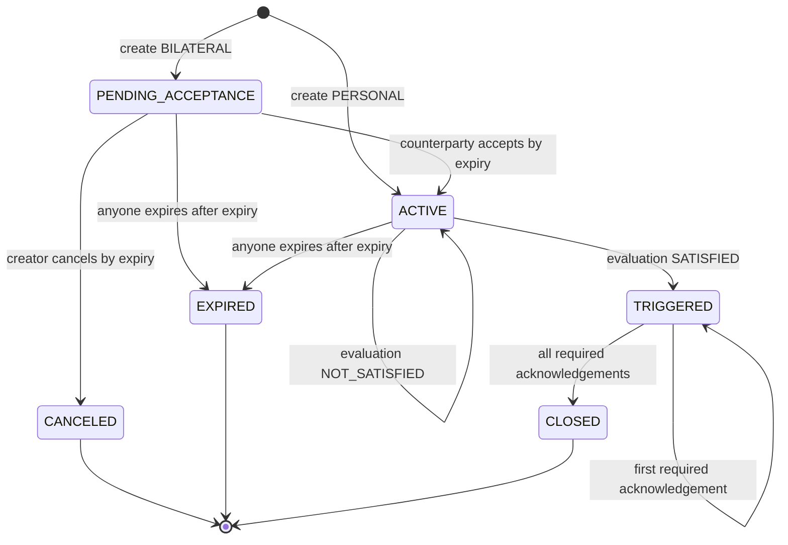

# Covenant state machine

PriceGuard Covenant V2 records conditions and evidence. It does not hold or transfer funds. Contract terms have no edit method; a creator can publish a new covenant with `revision_of` pointing to one of that creator's existing covenants.

## State diagram

## Transition table

| Operation | From | To | Authorized caller | Time and evidence preconditions |
| --- | --- | --- | --- | --- |
| `create_covenant` PERSONAL | none | `ACTIVE` | transaction sender becomes creator | `expiry > now`; validity no longer than 365 days from creation; `0 <= valid_from <= expiry`; exact input rules pass |
| `create_covenant` BILATERAL | none | `PENDING_ACCEPTANCE` | transaction sender becomes creator | Same creation time rules; counterparty is distinct and nonzero |
| `accept_covenant` | `PENDING_ACCEPTANCE` | `ACTIVE` | named counterparty only | `now <= expiry` |
| `cancel_unaccepted_covenant` | `PENDING_ACCEPTANCE` | `CANCELED` | creator only | `now <= expiry` |
| `evaluate_covenant` with unsatisfied condition | `ACTIVE` | `ACTIVE` | any address | `valid_from <= now <= expiry`; all three sources; HIGH confidence; no breaker; spread within covenant cap; consensus succeeds |
| `evaluate_covenant` with satisfied condition | `ACTIVE` | `TRIGGERED` | any address | Same evaluation requirements; condition evaluates true |
| `expire_covenant` | `ACTIVE` or `PENDING_ACCEPTANCE` | `EXPIRED` | any address | `now > expiry` |
| `acknowledge_outcome` PERSONAL | `TRIGGERED` | `CLOSED` | creator only | Creator has not already acknowledged |
| `acknowledge_outcome` BILATERAL, first party | `TRIGGERED` | `TRIGGERED` | unacknowledged creator or named counterparty | Caller has not already acknowledged |
| `acknowledge_outcome` BILATERAL, second party | `TRIGGERED` | `CLOSED` | remaining unacknowledged named party | Both acknowledgement flags become true |

`CANCELED`, `EXPIRED`, and `CLOSED` are terminal because no public write accepts those states as input. `TRIGGERED` cannot expire or be evaluated again.

## Creation rules

The creator is `gl.message.sender_address`, normalized to lowercase. A client request ID must contain 1–48 ASCII letters, digits, hyphens, or underscores. The deterministic covenant ID is derived from lowercase creator plus client request ID; the same creator cannot reuse a request ID.

Both modes require:

- symbol `BTC/USD` and policy `BTCUSD-1`;
- condition `ABOVE`, `BELOW`, `AT_OR_ABOVE`, `AT_OR_BELOW`, or `IN_RANGE`;
- positive two-decimal threshold scaling;
- `threshold_high` only for `IN_RANGE`, with low no greater than high;
- minimum confidence exactly `HIGH`;
- maximum spread from 0 through 100 basis points;
- future expiry no more than 365 days from contract execution time;
- memo no longer than 280 characters;
- an empty external reference or lowercase 32-byte hexadecimal hash; and
- an empty revision or an existing covenant created by the same creator.

User-authored memo, external reference, and revision fields are metadata. The contract does not verify an external document's meaning.

## PERSONAL and BILATERAL differences

| Rule | PERSONAL | BILATERAL |
| --- | --- | --- |
| Counterparty | Must be the zero address | Must be a distinct nonzero address |
| Initial state | `ACTIVE` | `PENDING_ACCEPTANCE` |
| Acceptance | Not applicable | Named counterparty must accept by expiry |
| Pre-acceptance cancellation | Not applicable | Creator may cancel by expiry |
| Counterparty index | Not added | Added at creation |
| Required acknowledgement after trigger | Creator | Creator and named counterparty, in either order |

Acceptance does not rewrite terms. It records `accepted_at`, moves one pending counter to active, and makes the original condition eligible for evaluation within its existing validity window.

## Evaluation outcomes

Any caller may request evaluation of an `ACTIVE` covenant during its inclusive time window. This openness does not grant authority over covenant terms or acknowledgements.

Evaluation runs the strict market consensus path. It requires all three fixed sources, `HIGH` confidence, breaker `false`, and source spread no greater than the covenant's cap. If consensus or any assertion fails, the transaction does not produce a valid evaluation state transition.

Each successful evaluation:

1. stores a new market snapshot and advances the global market sequence;
2. increments the covenant's evaluation count;
3. writes one deterministic exact attestation; and
4. records the latest evaluation time.

The condition operators are:

| Condition | Satisfied when |
| --- | --- |
| `ABOVE` | `evaluated_price > threshold_low` |
| `BELOW` | `evaluated_price < threshold_low` |
| `AT_OR_ABOVE` | `evaluated_price >= threshold_low` |
| `AT_OR_BELOW` | `evaluated_price <= threshold_low` |
| `IN_RANGE` | `threshold_low <= evaluated_price <= threshold_high` |

`NOT_SATISFIED` leaves the covenant `ACTIVE`. `SATISFIED` moves it once to `TRIGGERED` and records `trigger_snapshot_sequence`, `trigger_attestation_id`, and `triggered_at`.

## Acknowledgement behavior

Acknowledgement is available only in `TRIGGERED`:

- the creator may set `creator_acknowledged` once;
- for BILATERAL only, the named counterparty may set `counterparty_acknowledged` once; and
- any other caller or duplicate acknowledgement fails.

A PERSONAL covenant closes in the creator's acknowledgement transaction. A BILATERAL covenant remains `TRIGGERED` after the first named party acknowledges and closes when the other named party acknowledges. Closing records `closed_at` and updates protocol state counters.

Acknowledgement confirms an on-chain evidence state only. It does not acknowledge payment, delivery, legal liability, or an external action.

## Terminal states

- `CANCELED`: an unaccepted bilateral covenant canceled by its creator on or before expiry.
- `EXPIRED`: an untriggered pending or active covenant explicitly expired after its deadline.
- `CLOSED`: a triggered covenant for which every mode-required acknowledgement is recorded.

There is no public transition out of these states. Expiry is not automatic; a caller must submit `expire_covenant` after the deadline.

## Invalid transition examples

The contract rejects, among other cases:

- accepting a PERSONAL, already accepted, canceled, expired, or post-expiry covenant;
- acceptance by anyone other than the named bilateral counterparty;
- canceling an active or triggered covenant, canceling after expiry, or cancellation by the counterparty;
- evaluating before `valid_from`, after `expiry`, or from any state other than `ACTIVE`;
- evaluation with only two valid sources, non-HIGH confidence, breaker activation, or spread above the covenant cap;
- expiring on or before the expiry timestamp, or expiring a triggered, canceled, expired, or closed covenant;
- acknowledging before trigger, by an unrelated address, or twice by the same party;
- closing a bilateral covenant after only one acknowledgement; and
- creating a duplicate deterministic ID, invalid revision, self-counterparty, or covenant outside the input/time bounds.

## No custody or payment behavior

No lifecycle state represents a funded balance or asset claim. The V2 contract has no payable decorator, message-value read, balance ledger, transfer, beneficiary claim, creator refund, settlement, or administrator withdrawal. `TRIGGERED` and `CLOSED` are evidence states. Any external payment or action is outside PriceGuard and must be independently authorized and implemented.
